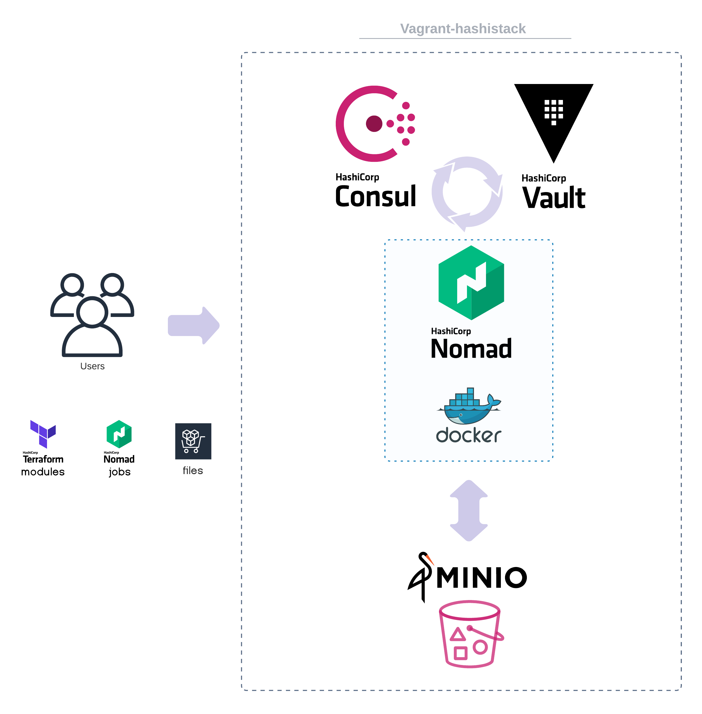

 
 <h2 align="center">Vagrant-hashistack</h2>
 
Hashistack in one click for development & testing

    
    
    
     
     
    

      
      
    

#

This vagrant box aims to make it dead simple to start a hashistack and emulating how services will deploy to production.

---
*This repository will release a new [template](template/README.md) into [fredrikhgrelland/vagrant-hashistack-template](https://github.com/fredrikhgrelland/vagrant-hashistack-template) on every release.*

---

> 🚧 - current vagrant box runs consul, nomad and vault in `dev` (development) mode.
- [consul development mode](https://learn.hashicorp.com/consul/getting-started/agent)
- [nomad development mode](https://learn.hashicorp.com/nomad/getting-started/running)
- [vault development mode](https://www.vaultproject.io/docs/concepts/dev-server)
---

## Content
1. [Description - what & why](#description---what--why)
2. [Install prerequisites](docs/2-install.md)
3. [Build](docs/3-build.md)
4. [Configuration](docs/4-configuration.md)
5. [Usage](docs/5-usage.md)
    1. [Simple run](docs/5-usage.md)
    2. [New project template](template/README.md)
6. [Test](docs/6-test.md)
7. [Proxy](docs/99-proxy.md)
8. [Contribution](docs/9-contributing.md)
9. [Diagram](#diagram)

## Description - what & why
This repository will build a base-box for different projects to extend on.
The base box contains components and a setup that makes it ideal for working with the hashistack.

### Services

The default box will start Nomad, Vault, Consul, and MinIO bound on loopback and advertising on the ip `10.0.3.10`, which should be available on your local machine.
Port-forwarding for `nomad` on port `4646` should bind to `127.0.0.1` and should allow you to use the nomad binary to post jobs directly.
Consul and Vault has also been port-forwarded, and are also available on `127.0.0.1` on port `8500` and `8200` respectively.
Minio is started on port `9000` and sharing /vagrant (your repo) from within the vagrant box.
- Nomad ui is available on [http://10.0.3.10:4646](http://10.0.3.10:4646) and all links to services should work.
- Consul ui is available on [http://10.0.3.10:8500](http://10.0.3.10:8500)
- Vault ui is available on [http://10.0.3.10:8200](http://10.0.3.10:8200)
- Minio ui is available on [http://10.0.3.10:9000](http://10.0.3.10:9000) (`minioadmin`:`minioadmin`)

*The master token for `Consul` and `Vault` is `master`.

### Why does this exist?

We needed a Vagrant box with the complete hashistack to use for demo, development and testing.
In order to build cloud native, security minded and dependable services, there exists a killer combination;
- Containers - (Docker)
- Simple&Powerful Orchestrator - (Nomad)
- Service-mesh mTLS - ([Consul connect](https://www.consul.io/docs/connect))
- Secrets management - (Vault)

### Hashistack

- [Consul](https://www.consul.io/)
- [Nomad](https://www.nomadproject.io/)
- [Vault](https://www.vaultproject.io/)
- [Terraform](https://www.terraform.io/)
- [Docker CE](https://www.docker.com/)

#### - with a side-play of

- [Ansible](https://www.ansible.com/)
- [Packer](https://www.packer.io/)
- [Consul-template](https://github.com/hashicorp/consul-template)
- [Minio](https://min.io/)

## Diagram

